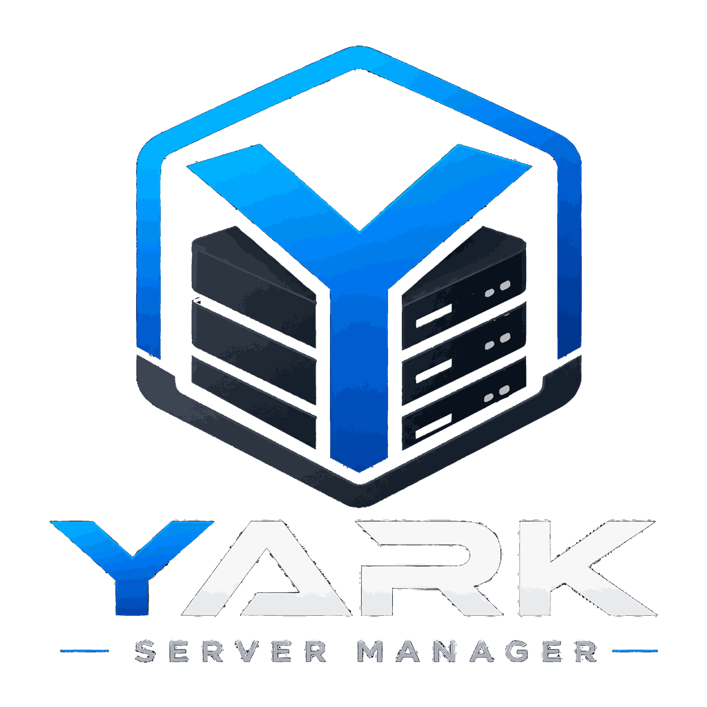
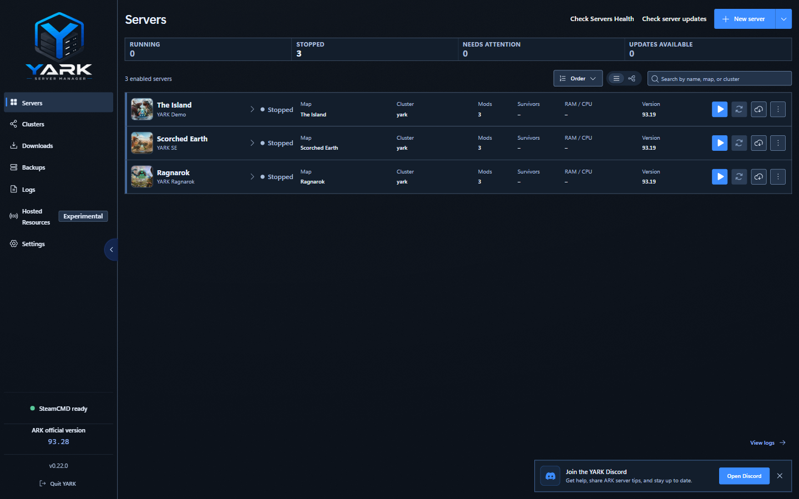
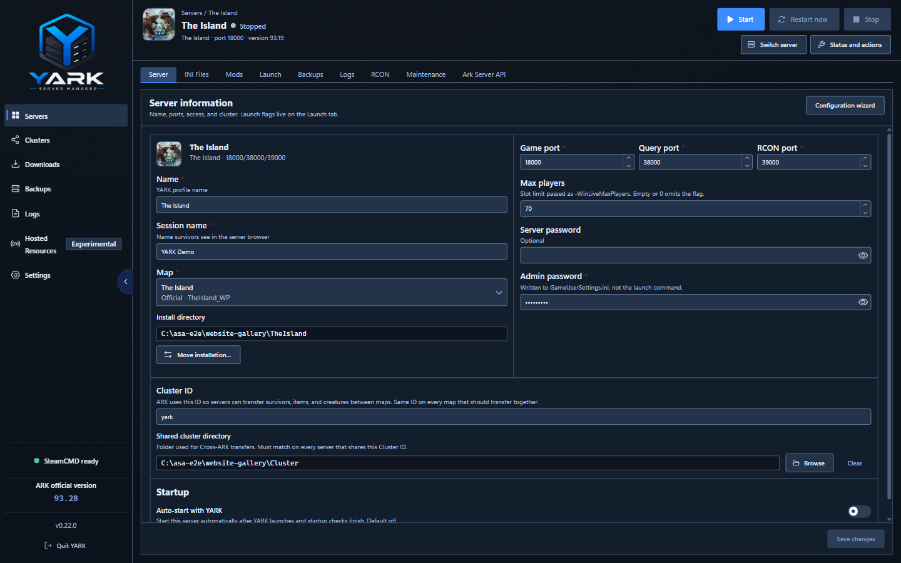
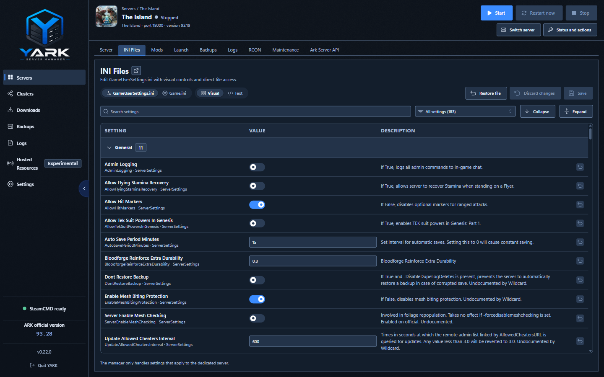
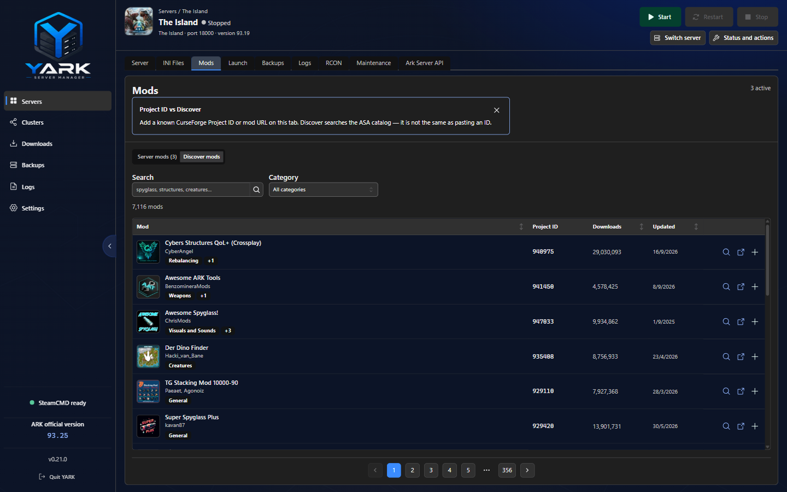
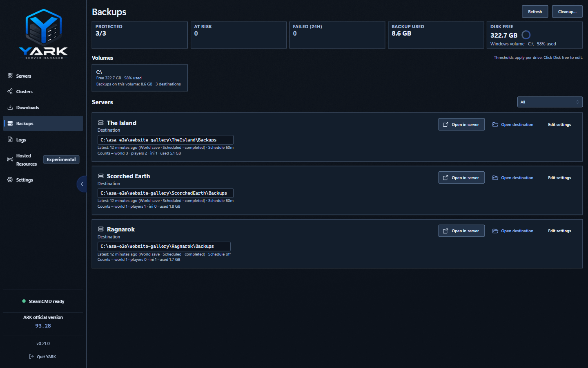

<p align="center">
  
</p>

<h1 align="center">YARK server manager</h1>

<p align="center">
  A local Windows desktop application for installing, configuring, operating, and recovering
  ARK: Survival Ascended dedicated servers.
</p>

<p align="center">
  <a href="https://github.com/gabomarin/yark/actions/workflows/ci.yml">
    
  </a>
  <a href="https://github.com/gabomarin/yark/releases">
    
  </a>
  <a href="LICENSE">
    
  </a>
  
</p>

<p align="center">
  <a href="https://gabomarin.github.io/yark/">Website</a>
  ·
  <a href="https://gabomarin.github.io/yark/docs/">Operator docs</a>
  ·
  <a href="https://github.com/gabomarin/yark/releases">Releases</a>
  ·
  <a href="https://github.com/gabomarin/yark/issues">Issues</a>
</p>

> [!WARNING]
> YARK is a public prerelease and is not production-ready. Current Windows installers are
> unsigned, so SmartScreen may warn. Download only from the official
> [GitHub Releases](https://github.com/gabomarin/yark/releases) page and follow the
> [download verification guide](https://gabomarin.github.io/yark/docs/getting-started/#verify-your-download).



## Why YARK?

Running an ASA dedicated server normally means coordinating SteamCMD folders, launch arguments,
INI files, ports, backups, logs, mods, and Windows processes by hand. YARK brings those concerns
into one desktop shell while keeping server files and operational data on the host you control.

The application is built for operators managing one or more local Windows servers. It is not a
cloud hosting service, an ARK game launcher, or an official Studio Wildcard product.

## Capabilities

| Area | What YARK provides |
| --- | --- |
| Server profiles | Create, clone, enable, disable, and manage multiple servers with independent paths, maps, ports, access settings, mods, and cluster fields. |
| Lifecycle | Start, stop, restart, and force-close exact managed processes; readiness waits for RCON instead of assuming a spawned process is healthy. |
| SteamCMD | Install, update, and verify ASA server files using a shared content cache and per-server operation history. |
| Safe maintenance | Coordinate stop, recovery backups, update/verify work, conditional restart, and rollback through locked backend operations. |
| Backups | Create, restore, export, and import world / player / INI archives; schedule world backups and inspect fleet health. |
| Configuration | Edit `GameUserSettings.ini` and `Game.ini` through visual and raw editors, with a guided configuration wizard. |
| Mods | Manage CurseForge Project IDs, metadata, enable/disable state, and launch-time `-mods=` composition without embedding the CurseForge API key. **Maps** packs: enable on Mods, then pick under Server Information → Map (Map mods / Custom…). |
| Diagnostics | Review events, runtime output, SteamCMD history, backup activity, installation health, host-port conflicts, and log retention. |
| Windows integration | System tray, close-to-tray, Start with Windows, Auto-start with YARK, in-app YARK updates, and Windows-aware process/file operations. |

## Product tour

| Server configuration | Visual INI editor |
| --- | --- |
|  |  |
| Identity, Move installation, networking, Auto-start, and cluster. | Searchable settings with descriptions and visual controls. |

| CurseForge mods | Backup operations |
| --- | --- |
|  |  |
| Per-server Project IDs, metadata, and enable/disable state. | Fleet health, destinations, schedules, and export/import across servers. |

More screenshots are available on the [project website](https://gabomarin.github.io/yark/#screenshots).

## Getting started

### For operators

You need:

- A supported Windows host for the YARK desktop application and ASA server binaries.
- Enough free disk space for SteamCMD downloads, the shared content cache, server installations,
  and backups.
- SteamCMD installed in a writable location, or a location YARK can use for installation and
  update operations.

Then:

1. Download the latest installer from [GitHub Releases](https://github.com/gabomarin/yark/releases).
2. Verify its SHA-256 digest using the
   [operator guide](https://gabomarin.github.io/yark/docs/getting-started/#verify-your-download).
3. Open **Settings** and select the folder containing `steamcmd.exe`.
4. Create a server profile with an absolute install path, unique game/query/RCON ports, and an
   admin password.
5. Install the dedicated-server files, review installation health, and start the server.
6. Create a backup before experimenting with updates, restores, or configuration changes.

See [Getting started](https://gabomarin.github.io/yark/docs/getting-started/) for the complete
operator walkthrough.

## Security and data boundaries

- Electron runs with context isolation, renderer sandboxing, no renderer Node integration, and an
  explicit preload bridge.
- Renderer navigation and new-window creation are denied; approved external CurseForge links pass
  through validated application handling.
- Profiles, settings, events, and backup metadata are stored locally in embedded SQLite. YARK has
  no user account or application cloud.
- Server/admin credentials currently exist in the local profile database and in ASA-required INI
  files. The database copy is not yet protected with Windows DPAPI; INI backups may also contain
  credentials.
- CurseForge metadata requests use a small Cloudflare Worker so the upstream API key is never
  embedded in the Electron application.
- Current installers are unsigned. Authenticode signing and RFC 3161 timestamp verification are
  tracked in [#142](https://github.com/gabomarin/yark/issues/142).

Read [Security & privacy](https://gabomarin.github.io/yark/docs/security-privacy/) before sharing
logs, configurations, app data, or backup archives.

## Development

### Requirements

- Windows is the primary development and packaging target.
- Node.js **22.12 or newer**.
- npm.

```bash
npm install
npm run dev
```

Common validation commands:

| Command | Purpose |
| --- | --- |
| `npm run typecheck` | Validate TypeScript without emitting files. |
| `npm run lint` | Enforce the current feature-file size policy. |
| `npm test` | Run the Vitest unit and integration suite. |
| `npm run build` | Build the Electron application. |
| `npm run package` | Build the Windows NSIS installer. |
| `npm run e2e:smoke` | Launch the compiled Electron shell and run the smoke flow. |
| `npm run website:dev` | Run the Astro/Starlight website locally. |
| `npm run website:build` | Build the public website and operator documentation. |

`npm install` enables Husky hooks:

| Hook | Validation |
| --- | --- |
| Pre-commit | Typecheck and lint |
| Pre-push | Typecheck, tests, and lint |

GitHub Actions runs typecheck, lint, tests, and build on `windows-latest` for pull requests
and pushes to `main`. Windows/Electron E2E and prepared-host ASA validation are tracked
separately because they require a graphical or real-server environment.

<details>
<summary>WSL and Linux development notes</summary>

YARK targets Windows process, path, SteamCMD, PowerShell, and robocopy behavior. Linux and WSL can
still be useful for editing, typechecking, and selected tests, but Windows-specific paths and
Electron optional dependencies may behave differently.

For a Windows checkout mounted in WSL, the repository hooks delegate to `cmd.exe` so they
use the Windows Node installation and win32 dependencies. See [AGENTS.md](AGENTS.md) for the
current environment-specific run notes.

</details>

## Architecture

```text
src/
├── main/       Electron main-process composition
├── preload/    Explicit renderer API and IPC bridge
├── renderer/   React + TypeScript desktop interface
├── backend/    Domains, persistence, processes, filesystem, and operations
└── shared/     Cross-process contracts and shared types

workers/
└── curseforge-proxy/   Cloudflare Worker for CurseForge metadata

website/                Astro + Starlight product site and operator docs
```

Persistence uses Node's built-in `node:sqlite`; there is no separate backend service.

## Documentation

| Guide | Scope |
| --- | --- |
| [Server lifecycle](docs/server-lifecycle.md) | Launch composition, process identity, readiness, stop/restart, and recovery. |
| [RCON console](docs/rcon.md) | Persistent workspace RCON session, players, ban list, and IPC. |
| [Settings](docs/settings.md) | App-wide preferences, desktop shell, SteamCMD path, and density. |
| [Clusters](docs/clusters.md) | Transfer-compliance reports, cluster fields, and launch-arg trio. |
| [Mods](docs/mods.md) | Workspace CurseForge inventory, load order, metadata proxy, and `-mods=` launch. |
| [Updates and SteamCMD](docs/updates-steamcmd.md) | Caches, install/update/verify, safe-update flow, rollback, and Windows validation. |
| [Backups](docs/backups.md) | Archive types, schedules, restore policy, retention, and recovery behavior. |
| [Logs](docs/logs.md) | Events, runtime logs, update history, storage, and troubleshooting. |
| [Component structure](docs/component-structure.md) | Renderer composition and feature-file policy. |
| [Design system](docs/design-system.md) | Theme tokens, shared surfaces, interaction patterns, and visual conventions. |
| [Visual testing](docs/visual-testing.md) | Required evidence and helpers for visible UI changes. |
| [Website](docs/website.md) | Astro/Starlight development, screenshots, CI, and GitHub Pages deployment. |
| [Versioning](docs/versioning.md) | SemVer, changelog policy, packaging, signing state, and release checklist. |
| [Agent context](docs/agent-context.md) | Repository orientation for AI-assisted development. |

Public operator documentation lives at
[gabomarin.github.io/yark/docs](https://gabomarin.github.io/yark/docs/).

## Roadmap and contributing

- The live release sequence is maintained in
  [#21 — Release roadmap](https://github.com/gabomarin/yark/issues/21).
- Bugs, feature proposals, and focused maintenance work are tracked in
  [GitHub Issues](https://github.com/gabomarin/yark/issues).
- Repository and GitHub artifacts use English as the language of record.
- Pull requests normally use squash merge so `main` keeps one commit per completed issue.
- Before proposing a visible UI change, follow the evidence requirements in
  [docs/visual-testing.md](docs/visual-testing.md).

When reporting a problem, include the YARK version, relevant sanitized logs, expected behavior,
and reproduction steps. Never attach passwords, raw INI files, app databases, or unreviewed
backup archives.

## License

YARK server manager is distributed under the
[GNU General Public License v3.0](LICENSE) (GPL-3.0-only).

ARK: Survival Ascended and related names are trademarks of their respective owners. YARK is an
independent community project and is not affiliated with or endorsed by Studio Wildcard.
